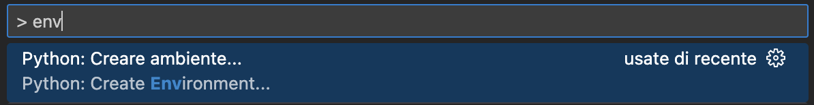

# LIA - Laboratorio di intelligenza artificiale
LIA - Laboratorio di intelligenza artificiale presso l'Università degli Studi di Parma (6 CFU).

```bash
Guida directory:
.
├── assets
├── notebooks
├── notes
└── slides
```

---

## Appunti

Benvenuti nella repository degli appunti presi a lezione del corso "Laboratorio di l'intelligenza artificiale".
In questa cartella troverete una raccolta di appunti e materiali utili per lo studio di questa disciplina.

## Setup environment

Per effettuare il setup del environment su Visual Studio Code:
1. Scaricare l'estensione `https://marketplace.visualstudio.com/items?itemName=ms-toolsai.jupyter`.
2. Aprire la palette dei comandi (solitamente Ctrl + Shift + P su Windows, Cms + Shift + P su MacOS).
3. Digitare "env" e selezionare la "Python: Crea ambiente". 
4. Selezionare lo strumento che si preferisce per creare l'ambiente virtuale.
5. Aprire un terminale, attivare l'ambiente creato nei punti precedenti (se non già attivo) e installare i pacchetti richiesti nel `requirements.txt`

## Contributors

<a href="https://github.com/unipr-org/LIA/graphs/contributors">
  
</a>
